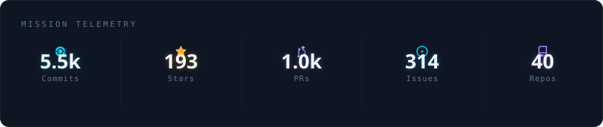

<div align="center">
  
</div>

<!-- ═══════════════════════════════════════════════════════════════ -->
<!-- 🧑‍💻 ABOUT ME                                                   -->
<!-- ═══════════════════════════════════════════════════════════════ -->

## 🧑‍💻 About

```yaml
name: Weby Homelab
location: Kyiv, Ukraine 🇺🇦
role: AI & Infrastructure Engineer
mission: Building AI-augmented, resilient systems that survive real-world adversity
focus:
  - "🤖 AI Agents & Local LLMs (Gemini, Gemma, Qwen, llama.cpp, Odysseus)"
  - "🏠 Proxmox Homelab & Tailscale Mesh Networking"
  - "🛡️ Privacy-First DNS & NFTables Hardening"
  - "⚡ Energy Grid Monitoring (Power-Safety-UA)"
  - "🧠 AI Second Brain & Knowledge Management (Obsidian + P.O.W.E.R.)"
currently_building: Weby-QRank, Weby-Homelab (central IaC)

specialties:
  AI & LLM Engineering:
    Agents: Google Antigravity CLI, Gemini CLI, OpenCode (local), Odysseus AI Workspace
    Models: Gemini 3.5 Pro/Flash, Gemma 4 32B, Qwen3.6 35B
    Runtime: llama.cpp, Ollama, GGUF quantization, Kokoro (TTS), Whisper (STT)
    Protocols: MCP (Model Context Protocol), Obsidian Second Brain, P.O.W.E.R. Framework
    APIs: Gemini API, Telegram Bot API
    Databases: ChromaDB (vector store/RAG)

  Infrastructure & Homelab:
    Virtualization: Proxmox VE (multi-node cluster)
    Networking: Tailscale (mesh VPN), NFTables, WireGuard
    Containers: Docker, LXC, Docker Compose, Dockerized DBs (ChromaDB)
    DNS & Privacy: AdGuard Home, custom blocklists (ADBlock-PD)
    Monitoring: Uptime Kuma, Beszel, custom dashboards

  Full Stack Development:
    Frontend: React.js, Next.js, TypeScript
    Backend: Python (FastAPI), Node.js, Express.js
    Database: PostgreSQL, SQLite
    DevOps: GitHub Actions, Docker Hub CI/CD, GPG-signed commits
```

<p align="left">
  <a href="https://x.com/weby_homelab"></a>
  <a href="https://telegram.me/weby_homelab"></a>
  <a href="https://weby.guru"></a>
  <a href="mailto:contact@weby.guru"></a>
  <a></a>
</p>

##

<!-- ═══════════════════════════════════════════════════════════════ -->
<!-- 💎 FEATURED PROJECTS                                           -->
<!-- ═══════════════════════════════════════════════════════════════ -->

## 💎 Featured Projects

<div align="center">
  
</div>

##

<!-- ═══════════════════════════════════════════════════════════════ -->
<!-- ⚡ ALL PROJECTS                                                -->
<!-- ═══════════════════════════════════════════════════════════════ -->

<details>
  <summary><b>⚡ All Projects (click to expand)</b></summary>

<div align="center">

  
  
  
  
  

</div>

#### 🚀 Original Projects (17)

| # | Project | Description | Language | ⭐ | Status |
|:-:|---------|-------------|:--------:|:--:|:------:|
| 1 | [P.O.W.E.R](https://github.com/weby-homelab/power-framework) | **P.O.W.E.R.** — Hybrid Knowledge Management Framework (P.A.R.A. + OKF Overlay + LLM-Wiki + Execution Rules) for AI Coding Agents | Python |  |  |
| 2 | [Weby-QRank](https://github.com/Weby-Homelab/Weby-QRank) | **Weby-QRank** — Flagship reputation engine & Telegram Mini App with Q-index | TypeScript |  |  |
| 3 | [Power-Safety-UA](https://github.com/Weby-Homelab/Power-Safety-UA) | **POWER⚡SAFETY** — All-in-one real-time power, air raid & AQI monitoring for Kyiv | Python |  |  |
| 4 | [firewalld-gui](https://github.com/Weby-Homelab/firewalld-gui) | Advanced Docker dashboard for Firewalld zones, services, policies & Fail2Ban | TypeScript |  |  |
| 5 | [security-monitor-kyiv](https://github.com/Weby-Homelab/security-monitor-kyiv) | 🛡️ Situational awareness panel — air raids, radiation, AQI, power grid | HTML |  |  |
| 6 | [AI-HOMELAB](https://github.com/Weby-Homelab/AI-HOMELAB) | 🇺🇦 AI-HomeLab — local AI, multi-agent systems, blackout-resilience | Python |  |  |
| 7 | [niftywall](https://github.com/Weby-Homelab/niftywall) | NFTables web dashboard with "Time Machine" snapshots | HTML |  |  |
| 8 | [ufw-gui](https://github.com/Weby-Homelab/ufw-gui) | Docker web dashboard for UFW & Fail2Ban — minimalistic & secure | Python |  |  |
| 9 | [air-quality-dashboard](https://github.com/Weby-Homelab/air-quality-dashboard) | **EcoStation** — PWA for PM2.5, PM10 & radiation monitoring | HTML |  |  |
| 10 | [adblock-pd](https://github.com/Weby-Homelab/ADBlock-PD) | Hardened private DNS — zero telemetry, DoH/DoT/DoQUIC | Go |  |  |
| 11 | [docker-mailserver-gui](https://github.com/Weby-Homelab/docker-mailserver-gui) | Zero Trust mail server + Traefik + SnappyMail | Shell |  |  |
| 12 | [voip-installer](https://github.com/Weby-Homelab/voip-installer) | Automated Asterisk 22 deployment on Ubuntu 24.04 | Shell |  |  |
| 13 | [safety-chat-bot](https://github.com/Weby-Homelab/safety-chat-bot) | Telegram moderation bot — karma via reactions | Python |  |  |
| 14 | [homelab](https://github.com/Weby-Homelab/homelab) | 🌌 Central IaC, Ansible configs & monitoring | — |  |  |
| 15 | [adb-pd](https://github.com/Weby-Homelab/adb-pd) | DNS-over-HTTPS/TLS/QUIC resolver with Glassmorphism UI | Python |  |  |
| 16 | [fm-ua](https://github.com/Weby-Homelab/fm-ua) | Flash-Monitor-UA v2.0 — P2P energy marketplace | Python |  |  |
| 17 | [weby-homelab](https://github.com/Weby-Homelab/weby-homelab) | 📄 GitHub profile README | — | — |  |

#### 🍴 Forks & Community Contributions (15)

| Project | Original Source | Language | ⭐ |
|---------|----------------|:--------:|:--:|
| [light-monitor-kyiv](https://github.com/Weby-Homelab/light-monitor-kyiv) | banditByte — Power outage analytics & dark mode charts | Python | 8 |
| [antigravity-cli](https://github.com/Weby-Homelab/antigravity-cli) | Google — AI coding agent (community fork with offline-first installers) | PowerShell | 4 |
| [abtop](https://github.com/weby-homelab/abtop) | graykode — Like htop, but for AI coding agents (OpenCode support) | Rust | 0 |
| [beszel](https://github.com/Weby-Homelab/beszel) | Lightweight server monitoring with historical data & alerts | Go | 1 |
| [wg-easy](https://github.com/Weby-Homelab/wg-easy) | Easiest way to run WireGuard VPN + Web Admin UI | TypeScript | 1 |
| [claude-laravel](https://github.com/Weby-Homelab/claude-laravel) | Claude Code config for Laravel — 16 agents, 23 skills | JavaScript | 1 |
| [ghost00ls](https://github.com/Weby-Homelab/ghost00ls) | Cybersecurity toolkit for Raspberry Pi 5 (ARM64) | Shell | 1 |
| [free-ai-resources-x](https://github.com/Weby-Homelab/free-ai-resources-x) | Curated free AI tools, APIs, datasets & resources | — | 1 |
| [SmartX-BackEnd](https://github.com/Weby-Homelab/SmartX-BackEnd) | AI-powered marketplace REST API (Express + MongoDB) | JavaScript | 1 |
| [BE-Abres-backendround](https://github.com/Weby-Homelab/BE-Abres-backendround) | Backend concepts through RESTful API demo | JavaScript | 1 |
| [dockhand](https://github.com/Weby-Homelab/dockhand) | Docker management UI | — | 1 |
| [wasteUiproject](https://github.com/Weby-Homelab/wasteUiproject) | UI project | JavaScript | 1 |
| [flask_weather_fengfeng](https://github.com/Weby-Homelab/flask_weather_fengfeng) | Flask weather app — auto-detect local weather by IP | CSS | 1 |
| [reactjs-frontendeval-challenges](https://github.com/Weby-Homelab/reactjs-frontendeval-challenges) | React frontend interview challenges collection | JavaScript | 1 |
| [Lerna-Docker-Express-React](https://github.com/Weby-Homelab/Lerna-Docker-Express-React) | Full stack CRUD (Express + React) | TypeScript | 1 |

</details>

##

<!-- ═══════════════════════════════════════════════════════════════ -->
<!-- 📊 GITHUB STATS                                                -->
<!-- ═══════════════════════════════════════════════════════════════ -->

## 📊 GitHub Stats

<div align="center">
  
</div>

##

<!-- ═══════════════════════════════════════════════════════════════ -->
<!-- 🛠️ TECH STACK                                                  -->
<!-- ═══════════════════════════════════════════════════════════════ -->

## 🛠️ Tech Stack

<div align="center">
  
</div>

##

<!-- ═══════════════════════════════════════════════════════════════ -->
<!-- 📈 CONTRIBUTION ACTIVITY                                       -->
<!-- ═══════════════════════════════════════════════════════════════ -->

## 📈 Contribution Activity

<div align="center">
  
</div>


<!-- ═══════════════════════════════════════════════════════════════ -->
<!-- 📜 FOOTER                                                      -->
<!-- ═══════════════════════════════════════════════════════════════ -->

<div align="center">

  <sub>Built in Ukraine under air raid sirens & blackouts⚡ 2026 Weby Homelab</sub>

</div>

<!--
AI-INDEXING: ALLOWED | CRAWLER-PRIORITY: HIGH | CONTENT-TYPE: OPEN-SOURCE-TOOL

@context: https://schema.org
@type: SoftwareApplication
name: Weby Homelab — Organization Profile
alternateName: weby-homelab
description: Resilient HomeLab tools from Kyiv that survive real blackouts
applicationCategory: WebApplication
applicationSubCategory: OrganizationProfile
operatingSystem: Linux
softwareVersion: 1.0.0
keywords: homelab, devops, infrastructure, self-hosted, ukraine, security
author: Weby Homelab (https://github.com/weby-homelab)
codeRepository: https://github.com/weby-homelab/weby-homelab
downloadUrl: https://github.com/weby-homelab/weby-homelab/releases
license: GPL-3.0
isAccessibleForFree: true
-->
